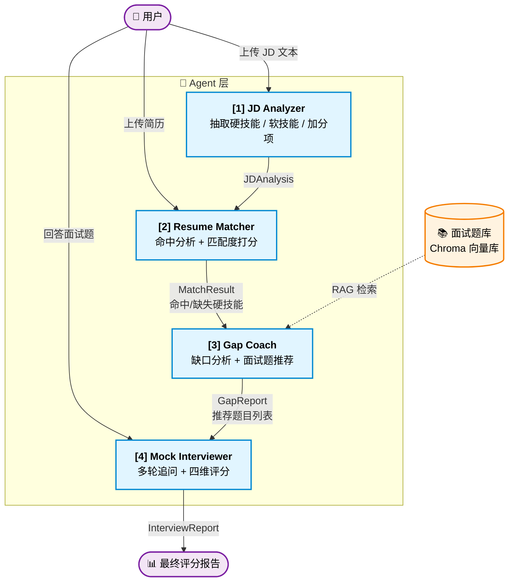
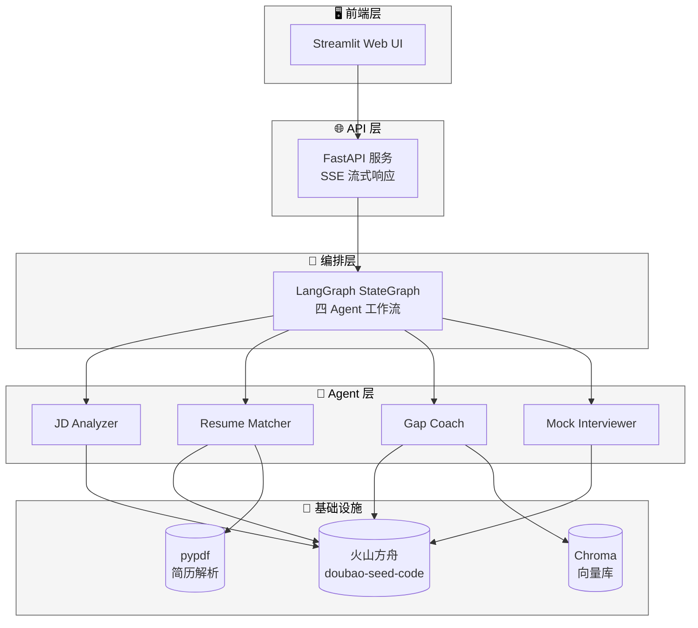

# 系统架构

> JobHunter Agent 的整体架构说明。本文档描述四个核心 Agent 的职责分工、数据流转关系,以及未来 Web 层与数据依赖的整体分层。

---

## 一、Agent 数据流图

四个 Agent 按管道式串联,前一个 Agent 的结构化输出即为下一个 Agent 的输入。所有数据结构均以 Pydantic 定义,保证跨 Agent 传递时的类型安全。

---

## 二、Agent 职责与 I/O 契约

每个 Agent 都遵守"结构化输入 → 结构化输出"的契约,输出即为下一个 Agent 的输入,保证解耦。

| # | Agent | 输入 | 输出 | 状态 |
|---|-------|------|------|------|
| 1 | **JD Analyzer** | `jd_text: str` | `JDAnalysis`(硬技能 / 软技能 / 加分项 / job_title) | ✅ Day 2-3 完成 |
| 2 | **Resume Matcher** | 简历文本 + `JDAnalysis` | `MatchResult`(总分 / 分项分 / 命中 / 缺失 / 总评) | ✅ Day 5-6 文本 MVP + Day 7 PDF 解析 |
| 3 | **Gap Coach** | `MatchResult` + 题库 | `GapReport`(缺口清单 / 推荐题目列表) | 📋 Week 4 |
| 4 | **Mock Interviewer** | `GapReport` + 用户答题 | `InterviewReport`(多轮记录 / 四维评分) | 📋 Week 5 |

### 职责边界的关键约定

- **JD Analyzer** 只做**抽取**,不做归纳、不做改写。
- **Resume Matcher** 由 LLM 判断语义命中,由 Python 补全缺失并按硬技能 70% / 软技能 20% / 加分项 10% 确定性计算分数。
- **Gap Coach** 把 Matcher 的"缺失"转成**可执行的补强路径**——这才是它独立存在的价值。
- **Mock Interviewer** 只做**追问和评分**,不承担出题职责(题目来自 Gap Coach)。

> 之所以严格划分,是为了让每个 Agent 的 Prompt 和 Schema 都能独立演进,不至于一个 Agent 的改动引起雪崩式返工。

---

## 三、系统分层图(Week 6-7 完成)

Web 层和编排层会在 Week 6-7 落地。当前 Day 4 只画整体分层示意,细节待后续实现时补充。

---

## 四、技术选型说明

| 层次 | 技术 | 选它的理由 |
|------|------|-----------|
| **LLM 编排** | LangChain + LangGraph | LangChain 处理单 Agent 的 Prompt/Parser 管道;LangGraph 负责多 Agent 的状态机编排,支持条件分支和循环 |
| **结构化输出** | Pydantic + `PydanticOutputParser` | 不依赖厂商的 function calling,靠 Prompt 引导 + Parser 兜底,兼容性最好(火山方舟当前对 `response_format` 支持不稳定) |
| **模型** | 火山方舟 doubao-seed-code | 免费额度充足,中文抽取任务表现稳定 |
| **向量库** | Chroma | 本地即可跑,零运维,适合项目规模 |
| **Web** | FastAPI + Streamlit | 快速验证,前后端解耦 |
| **PDF 解析** | pypdf | 纯 Python,无系统依赖 |

---

## 五、数据结构约束

所有跨 Agent 传递的数据都必须是 Pydantic 模型,不允许 dict 裸传。已定义或计划定义的 Schema:

| Schema | 文件 | 状态 |
|--------|------|------|
| `JDAnalysis` | `schemas/jd.py` | ✅ |
| `Resume` | `schemas/resume.py` | 📋 PDF 解析阶段 |
| `MatchResult` | `schemas/match.py` | ✅ |
| `GapReport` | `schemas/gap.py` | 📋 |
| `InterviewReport` | `schemas/interview.py` | 📋 |

> 图例:✅ 已完成 · 🚧 进行中 · 📋 待启动
